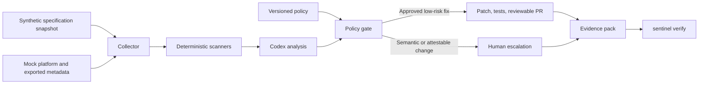

# QI Sentinel Architecture

## Design intent

QI Sentinel is a bounded compliance automation loop for a synthetic quality-measure platform. Its central design rule is:

> Deterministic code owns decisions; Codex owns reasoning and writing.

The model may explain a finding, produce root-cause analysis, and draft a patch. It may not create rule IDs, change severity, lower a threshold, select its own remediation class, override a failed gate, attest to missing history, merge a pull request, or deploy code.

## System context



## Monitoring cycle

| Stage | Owner | Responsibility | Output |
| --- | --- | --- | --- |
| Collect | Code | Load approved inputs, redact log samples, and hash inputs, policy, prompt, and specification | Immutable snapshot manifest |
| Scan | Code | Run the four rules and assign rule ID, severity, confidence basis, and evidence references | Raw findings |
| Analyse | Codex | Compare semantic logic with the supplied synthetic spec; write RCA, explanations, and patch drafts using a validated schema | Enriched findings |
| Gate | Code | Evaluate every proposed action against six required policy conditions and the hard floor | Disposition and gate trace |
| Act | Code plus Codex | Apply allowed patches, run tests, open one PR, and write escalation records | PR and escalations |
| Evidence | Code | Assemble canonical JSON, render the human-readable report, and compute hashes | Verifiable evidence pack |

The same orchestration path supports local CLI execution and CI. Observe mode performs collection, scanning, analysis, and evidence generation but holds every change for human review.

## Components

### Collector

The collector reads the approved synthetic specification, repository artifacts, policy exports, structured logs, and lineage metadata. It records SHA-256 hashes and provenance before scanning. Sensitive log fields are redacted before any content is provided to Codex.

### Deterministic scanners

Each scanner has clean and seeded fixtures and emits a shared finding schema.

| Rule | Scanner responsibility | Default disposition |
| --- | --- | --- |
| `QI-MASK-001` | Compare PHI-tagged columns with approved Snowflake masking-policy attachments | Auto-fix eligible |
| `QI-LOG-001` | Detect configured sensitive fields and synthetic sensitive patterns in application logs | Auto-fix eligible |
| `QI-SEM-001` | Compare value-set pins and measure exclusions with the synthetic specification | Escalate |
| `QI-LIN-001` | Validate the run-to-source-to-output lineage chain | Escalate |

Detection remains deterministic even for `QI-SEM-001`; Codex enriches the finding with analysis but is not required to decide whether the defect exists.

### Codex analysis adapter

All Codex integration is isolated under `src/qi_sentinel/agent/`. The adapter:

- accepts only an allowlisted, redacted context bundle;
- uses a versioned prompt whose hash is recorded in evidence;
- requires schema-valid structured output;
- rejects unknown rule IDs or unsupported dispositions;
- treats repository content as untrusted data, not instructions;
- returns narrative, RCA, recommended next action, and optional patch drafts.

The official stable Python SDK is pinned as `openai-codex==0.154.0`. The adapter uses an ephemeral read-only thread, the enterprise-compatible auto-review approval mode, and a JSON Schema supplied to `Thread.run`; CI action pinning remains a Phase 5 decision.

### Policy gate

An automatic remediation is allowed only if all conditions pass:

1. The rule is explicitly marked `auto_fix_allowed: true`.
2. The change does not alter measure population semantics.
3. Confidence meets the configured threshold, initially `0.95`.
4. Every changed file and executed command is allowlisted.
5. Unit, policy, regression, and evidence-integrity tests pass.
6. The result is submitted as a pull request and is never merged automatically.

The hard floor always blocks the following categories, regardless of rule configuration:

- `measure-semantics`
- `evidence-attestation`
- `access-grant-widening`

The policy is stored in `config/policy.yml`, reviewed through Git, and hashed into every evidence pack. Supported modes are `enforce` and `observe`. `pull_requests.merge` is always `never` in the PoC.

### Action executor

For approved fixes, the executor creates or updates a fingerprinted branch, applies allowlisted changes, runs all required tests, and opens or updates one reviewable PR. For blocked findings, it creates an escalation containing expected versus observed behavior, root cause, impact, evidence, owner, recommended action, and an optional unapplied patch.

Each record carries a stable fingerprint derived from the rule ID, target, and expected state. An identical second run updates the existing open record rather than producing a duplicate.

### Evidence service

Each run creates:

```text
artifacts/<run-id>/
|-- evidence.json
`-- index.html
```

The canonical JSON includes run timestamps, repository commit, runtime versions, specification and policy identifiers, hashes, findings, gate results, actions, tests, approvals, and generated-artifact hashes. `sentinel verify` recomputes the hashes and fails if content differs.

The HTML report is derived from the canonical JSON and exists for reviewer readability. It is not an independent source of truth.

## Repository structure

Implementation paths are relative to `Deliverable/Src/`, the source-project root.

```text
Deliverable/Src/
|-- .github/
|   |-- workflows/qi-sentinel.yml
|   `-- codex/prompts/monitor.md
|-- config/
|   |-- policy.yml
|   `-- sentinel.yml
|-- mock-platform/
|   |-- measures/
|   |-- pipelines/
|   |-- snowflake/
|   |-- logs/
|   `-- lineage/
|-- specs/
|   `-- synthetic-2026/
|-- src/qi_sentinel/
|   |-- agent/
|   |-- evidence/
|   |-- policy/
|   |-- scanners/
|   `-- cli.py
|-- tests/
|   |-- fixtures/
|   |-- integration/
|   `-- unit/
|-- artifacts/
|-- pyproject.toml
`-- README.md
```

## CLI contract

| Command | Responsibility |
| --- | --- |
| `sentinel seed` | Materialize or validate the synthetic seeded scenario |
| `sentinel scan` | Execute collection, scanning, analysis, gate evaluation, and evidence generation |
| `sentinel remediate` | Apply policy-approved fixes and prepare review records |
| `sentinel verify` | Verify the evidence pack and referenced hashes |
| `sentinel dashboard` | Optional stretch command; not required for the minimum PoC |

## CI architecture

GitHub Actions uses scheduled and manual trusted triggers only.

- The `scan` job has `contents: read`, runs the non-remediating path, and uploads evidence.
- The `remediate` job depends on a successful scan, runs only in the owning repository, and receives only `contents: write` and `pull-requests: write`.
- Fork content never executes with secrets or write permissions.
- The Codex action is pinned to a commit SHA and runs with the narrowest supported sandbox.
- The project-scoped API key is stored only as an Actions secret and is never copied into evidence or logs.

## Security and compliance boundaries

| Control | Enforcement |
| --- | --- |
| Synthetic-only data | Fixture review and publication scan; no production records |
| Control-plane-only access | Collectors read code, configuration, and exported metadata, not table rows |
| Redaction before reasoning | Collector sanitizes log samples before model invocation |
| No fabricated evidence | Missing lineage is escalated; templates are clearly marked unattested |
| Bounded writes | File and command allowlists plus policy hard floor |
| Prompt-injection resistance | Repository text is untrusted; schemas and deterministic policy constrain outputs |
| CI least privilege | Separate scan and remediation jobs with trusted triggers |
| No automatic deployment | PR creation only; merge is disabled |
| Publication hygiene | Credential and synthetic-sensitive-pattern scans before artifact upload |

## Accepted architecture decisions

1. Use exported platform-shaped metadata instead of live Databricks or Snowflake connections for the PoC.
2. Keep all dispositions deterministic; use Codex only for bounded reasoning and writing.
3. Use Python 3.12 and isolate the pinned Codex dependency behind one adapter.
4. Store policy as versioned YAML with allowlists and a non-overridable hard floor.
5. Use canonical hashed JSON plus generated HTML for portable evidence.
6. Split read-only scanning from write-scoped remediation in CI.
7. Escalate value-set changes because they can alter measure populations.
8. Prioritize the CLI, PR, escalation, and evidence pack over a dashboard.
