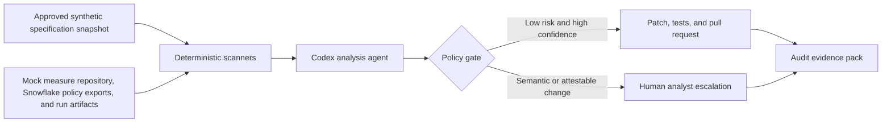

# QI Sentinel

**Continuous Compliance Agent for Quality Measure Integrity**

> “QI Sentinel uses fully synthetic data and synthetic measure specifications for the hackathon. The architecture supports governed integration with licensed HEDIS, CMS, and internal specification sources in production.”

QI Sentinel is a hackathon prototype that treats quality-measure integrity as a continuously monitored property of the delivery platform rather than a submission-time audit exercise. It examines measure logic, value-set references, pipeline configuration, run outputs, logs, and lineage records; detects drift from approved specifications and governance policy; proposes corrective changes; and produces an audit-ready evidence trail.

The prototype uses synthetic data only. It is not a production compliance determination system and does not process protected health information (PHI).

## The opportunity

Quality reporting programs such as HEDIS, CMS Stars, and internal quality indices evolve throughout the year. Measure logic, code sets, value sets, and data pipelines can drift while assurance remains manual and concentrated near submission deadlines. The result is late discovery, expensive re-verification, reconstructed audit evidence, and avoidable financial exposure.

QI Sentinel moves those controls earlier in the lifecycle:

- Detect specification and data-pipeline drift on every monitoring cycle.
- Apply low-risk, high-confidence corrections behind a policy gate.
- Escalate changes that affect measure meaning or require human attestation.
- Preserve the source, reasoning, change, tests, and disposition as evidence.
- Give quality analysts a completed root-cause analysis instead of an unexplained alert.

## Hackathon demonstration

The mock repository is intentionally seeded with four realistic defects. In one monitoring cycle, QI Sentinel should find all four, automatically remediate two, escalate two, and generate one evidence pack.

| ID | Layer | Seeded defect | Detection method | Policy decision |
| --- | --- | --- | --- | --- |
| `QI-MASK-001` | Snowflake (reporting) | Masking policy removed from a PHI-tagged column in the reporting schema | Policy export vs. column-tag comparison | Auto-fix: restore the last approved policy and verify |
| `QI-LOG-001` | Cross-cutting | Synthetic member information written to application logs | Structured log and sensitive-field scan | Auto-fix: redaction and verify |
| `QI-SEM-001` | Databricks (measure compute) | Measure pins an outdated value-set version after the annual specification update, and a denominator exclusion no longer matches the approved specification | Versioned manifest comparison plus logic/AST comparison | Escalate: measure semantics |
| `QI-LIN-001` | Cross-cutting | Required data-lineage record is missing | Run-to-source-to-output chain validation | Escalate: evidence cannot be invented |

A value-set version update is escalated rather than auto-fixed. A new version changes which members fall into the numerator or denominator, so it alters measure population semantics (policy gate rule 2). The agent may attach a draft patch for the analyst to review.

The missing-lineage finding may include a proposed record template, but the agent must never fabricate historical evidence.

Optional fifth seed, if time allows: `QI-FEED-001`, a required supplemental clinical feed manifest missing for the current measurement period (Data Lake). It is escalated to data engineering because missing data cannot be auto-fixed.

## How it works



Deterministic code owns rule IDs, severity, confidence thresholds, auto-fix eligibility, checksums, and test outcomes. Codex supplies repository-level reasoning, root-cause analysis, patch generation, plain-language findings, and evidence narration. A human remains the final authority for measure-semantic changes and production deployment.

## Policy gate

An automatic remediation is allowed only when all of the following are true:

1. The finding maps to an approved rule with `auto_fix_allowed: true`.
2. The proposed change does not alter measure population semantics.
3. Confidence meets the configured threshold.
4. The change is limited to allowlisted files and commands.
5. Unit, policy, regression, and evidence-integrity tests pass.
6. The resulting change is submitted for review rather than merged directly.

All other findings are escalated with affected files, expected and observed behavior, root cause, impact, supporting evidence, and a recommended next action.

## Evidence pack

Each monitoring cycle produces machine-readable JSON and a reviewer-friendly Markdown or HTML report containing:

- Run ID, timestamps, repository commit, and agent/runtime version
- Specification identifier, effective date, and content checksum
- Rule ID, severity, confidence, and policy disposition
- Sanitized source references and observed evidence
- Root-cause analysis and plain-language explanation
- Proposed or applied diff
- Test commands and results
- Human approval or escalation status
- Hashes for generated evidence artifacts

## Intended repository layout

```text
qi-sentinel/
|-- .github/
|   |-- workflows/qi-sentinel.yml
|   `-- codex/prompts/monitor.md
|-- config/
|   |-- policy.yml
|   `-- sentinel.yml
|-- mock-platform/
|   |-- measures/
|   |-- pipelines/
|   |-- snowflake/
|   |-- logs/
|   `-- lineage/
|-- specs/
|   `-- synthetic-2026/
|-- src/qi_sentinel/
|   |-- agent/
|   |-- evidence/
|   |-- policy/
|   |-- scanners/
|   `-- cli.py
|-- tests/
|   |-- fixtures/
|   |-- integration/
|   `-- unit/
|-- artifacts/              # generated; do not commit sensitive content
|-- .env.example
|-- pyproject.toml
`-- README.md
```

## Technology choices

- Python 3.12 for orchestration and deterministic scanners
- OpenAI Codex Python SDK (`openai-codex`, beta; version pinned) for programmatic repository analysis and patch generation, isolated behind `src/qi_sentinel/agent/` so SDK changes stay contained
- YAML/JSON specification snapshots and policy configuration
- SQLite or local JSON for hackathon run metadata
- pytest for unit and integration tests
- GitHub Actions and [OpenAI's Codex Action](https://learn.chatgpt.com/docs/github-action) for the CI demonstration

Docker is optional and is deliberately excluded from the minimum hackathon path.

## Prerequisites

- Python 3.12 or later (3.10 is the SDK minimum)
- pip (or uv)
- Git
- Codex access for local interactive development
- An OpenAI Platform project and API key for unattended GitHub Actions runs
- A GitHub repository where Actions are enabled

No local GPU is required. A modern four-core CPU, 16 GB RAM, 20 GB of free SSD space, and a stable internet connection are recommended.

## Quick start

> The commands below describe the intended scaffold and become executable as the prototype is implemented.

```bash
git clone <repository-url>
cd qi-sentinel
python -m venv .venv
source .venv/bin/activate      # Windows: .venv\Scripts\activate
pip install -e ".[dev]"
```

Create a local environment file:

```bash
cp .env.example .env
```

Set the server-side credential only if the selected local authentication path requires it:

```text
OPENAI_API_KEY=replace-with-a-project-scoped-key
```

Never commit `.env` or expose the key in browser code, logs, prompts, screenshots, or evidence artifacts.

Seed and run the synthetic demonstration:

```bash
sentinel seed
sentinel scan
pytest
sentinel verify
```

Start the optional dashboard:

```bash
sentinel dashboard
```

## Expected demo result

```text
Monitoring cycle: COMPLETE
Findings:        4
Auto-remediated: 2
Escalated:       2
Tests:           PASS
Evidence pack:   artifacts/<run-id>/index.html
```

The demonstration should show:

1. The seeded defects in the initial repository state.
2. A single QI Sentinel monitoring cycle.
3. Four findings with traceable evidence.
4. A generated branch or pull request containing the two permitted fixes.
5. Two analyst-ready escalation records.
6. A verifiable evidence pack with no secrets or sensitive data.

## GitHub Actions configuration

Create a project-scoped OpenAI API key and store it in the repository or organization Actions secrets as:

```text
OPENAI_API_KEY
```

The workflow should use a trusted trigger, an Ubuntu runner, explicit permissions, and the narrowest practical Codex sandbox. Opening a corrective pull request typically requires `contents: write` and `pull-requests: write`; scanning-only jobs should use read-only permissions.

Do not run an auto-remediation workflow on untrusted fork content with write permissions or exposed secrets. Treat repository files, issue text, commit messages, and pull-request content as potentially adversarial prompt input.

## Security, privacy, and compliance boundaries

- All hackathon member, claim, encounter, and log data is synthetic.
- No PHI, production credentials, proprietary production logic, or member-identifiable content may enter prompts or artifacts.
- Internet access should be disabled for the agent during the demo; approved synthetic specification snapshots are committed locally.
- Specification inputs must be versioned and checksummed.
- Agent file writes and commands must be allowlisted and sandboxed.
- Automatic fixes create reviewable pull requests; they do not merge or deploy themselves.
- Logs and evidence are scanned for credentials and sensitive-field patterns before publication.
- QI Sentinel reports conformance to the supplied synthetic rules; it does not certify HEDIS, CMS, HIPAA, or audit compliance.

Any pilot involving real PHI requires organizational privacy, security, legal, and compliance review; an applicable OpenAI agreement and BAA; eligible services; approved endpoint and retention configuration; and documented controls for workstations, repositories, plugins, tools, and downstream systems. See the [OpenAI HIPAA configuration guide for Codex](https://learn.chatgpt.com/docs/hipaa-configuration).

## Success criteria

- Detect all four seeded issues in one repeatable run.
- Produce no false negatives against the seeded fixture set.
- Produce no findings against the clean baseline fixtures.
- Auto-fix exactly the two policy-approved findings.
- Escalate both non-automatic findings with actionable root-cause analysis.
- Pass regression tests after remediation.
- Produce a complete, tamper-evident evidence pack.
- Expose no API keys or synthetic sensitive fields in published output.

## Expected impact

- Earlier detection of specification and pipeline drift
- Less analyst time spent repeatedly validating unchanged logic
- Faster audit response through evidence generated at detection time
- Reduced risk to quality-linked revenue and Star Ratings
- A reusable governance pattern for claims exceptions, interfaces, and access-control drift

## Roadmap

### Hackathon

- Mock measure repository and approved synthetic specification snapshot
- Four deterministic scanners and a policy gate
- Codex-assisted findings, fixes, and escalation narratives
- Pull-request workflow and evidence pack
- Lightweight results dashboard

### Pilot

- Select one approved measure family and Quality analytics owner
- Integrate authoritative, licensed specification inputs
- Establish gold-standard evaluation cases and false-positive targets
- Complete security, privacy, legal, and model-risk reviews
- Run in observation-only mode before enabling corrective pull requests
